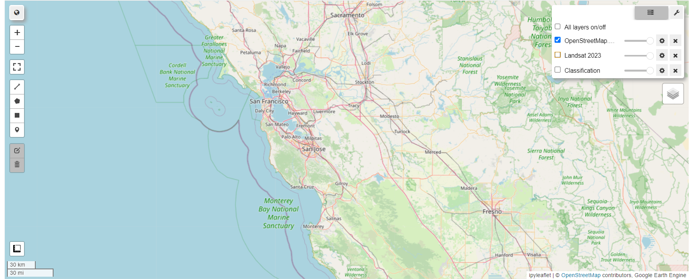
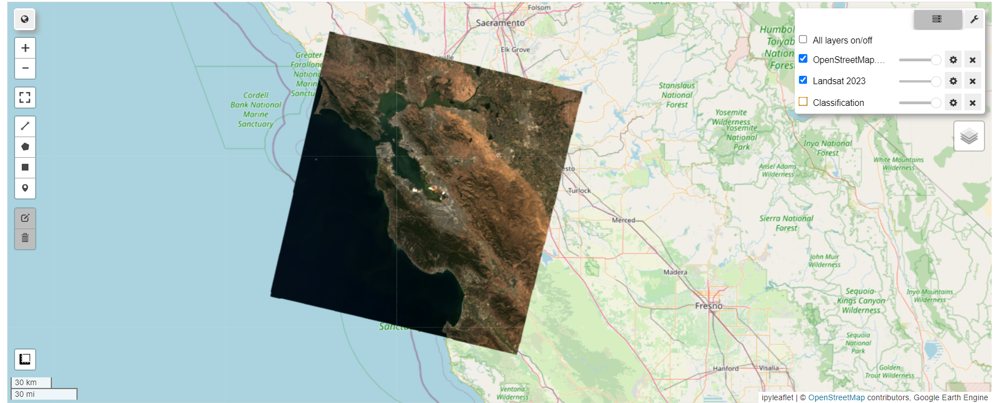
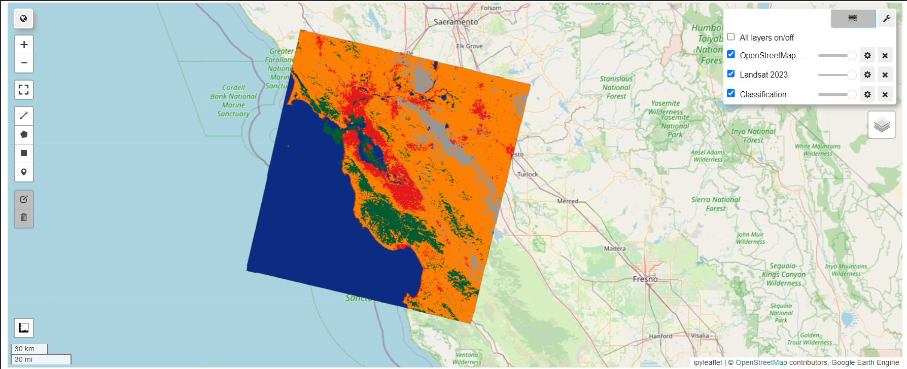

# Random Forest Classification with LANDSAT 8


This Jupyter notebook demonstrates the process of performing Random Forest classification using LANDSAT 8 satellite imagery. The analysis leverages Google Earth Engine (GEE) for data processing and visualization, incorporating the FOLIUM library and Geemap for interactive mapping.

## Table of Contents

1. [Initializing Earth Engine and Import Libraries](#initializing-earth-engine-and-import-libraries)
2. [Define a Region of Interest](#define-a-region-of-interest)
3. [Load LANDSAT 8 Data](#load-landsat-8-data)
4. [Classification Model](#classification-model)
5. [FOLIUM App](#folium-app)
6. [Geemap](#geemap)


## Prerequisites

- Python 3.x
- Jupyter Notebook
- Google Earth Engine account
- Required libraries (e.g., `geemap`, `folium`, `numpy`)

## How to Run the Notebook

1. Clone the repository:
   ```bash
   git clone https://github.com/arnabsaha7/SmartGeoMapping.git
   cd SmartGeoMapping
   ```

2. Install the required libraries (if not already installed):
   ```bash
   pip install geemap folium numpy 
   ```

3. Open the Jupyter notebook:
   ```bash
   jupyter notebook RF_Classification_with_LANDSAT_8.ipynb
   ```

4. Follow the instructions in the notebook to execute each section.

## Visualizations

Here are some visual outputs generated from the analysis:

<p align="center">
  <div style="display:inline-block; margin:10px; text-align:center;">
    
    <div style="margin-top: 5px;">Original LANDSAT Image</div>
  </div>
  <div style="display:inline-block; margin:10px; text-align:center;">
    
    <div style="margin-top: 5px;">LANDSAT 8 Data</div>
  </div>
  <div style="display:inline-block; margin:10px; text-align:center;">
    
    <div style="margin-top: 5px;">Classification Result</div>
  </div>
</p>

## License

This project is licensed under the MIT License - see the [LICENSE](LICENSE) file for details.

## Acknowledgments

- Google Earth Engine team
- LANDSAT data providers
- Contributors to the libraries used


---
For any inquiries or contributions, feel free to reach out!
